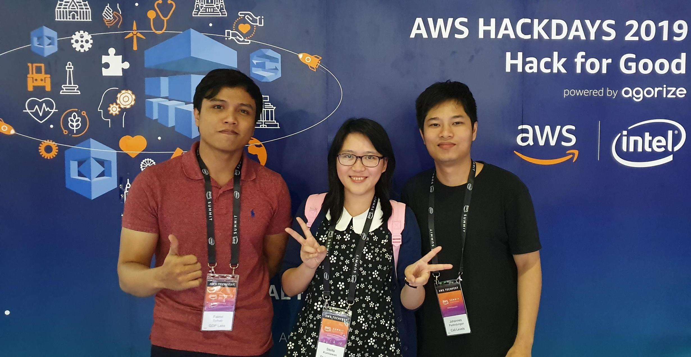
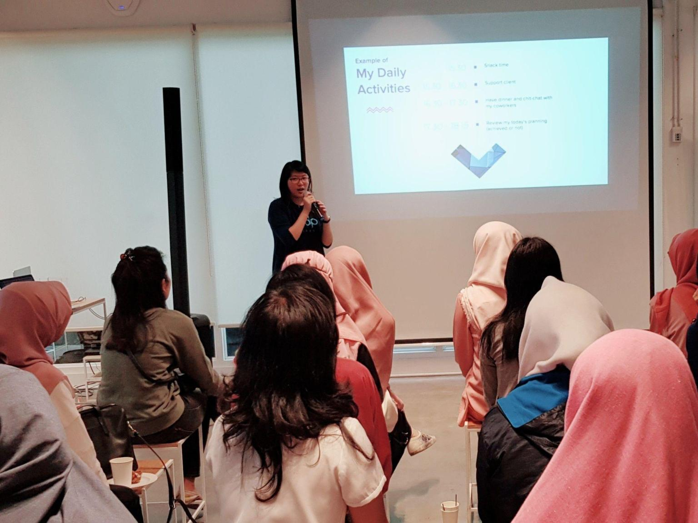

### AWS Hackdays 2019

My team won the 1st place at AWS Hackdays 2019 Indonesia and secured the 3rd place position at the Grand Final in 
Singapore. We built two products for this competition. Aident, a real time crime activity detection and criminals face recognition system. Second one is Eyve, it is built to protect visually impaired in daily life. 

### Facebook Developer Circle 2018

Shared my journey and stories as a product manager for B2B products in a special event 'Kartini Day' to empower women in tech industry. 

